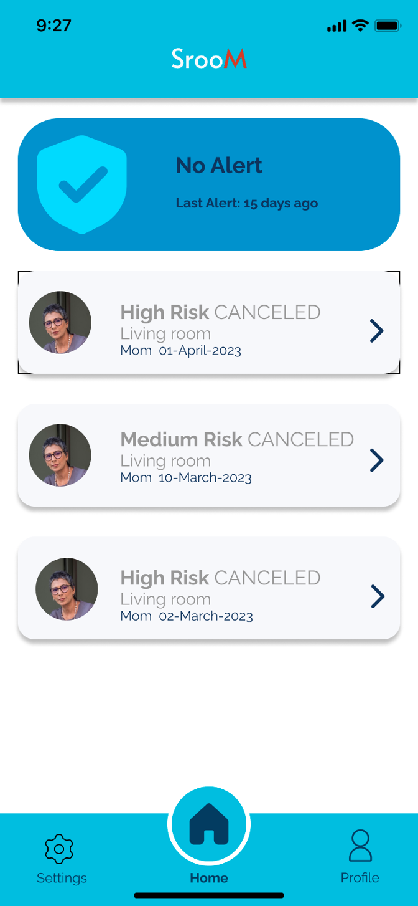
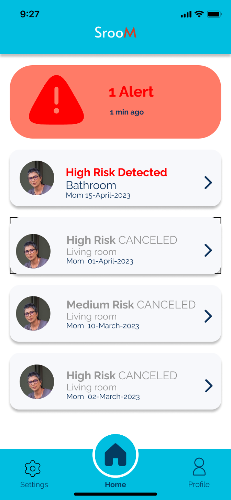
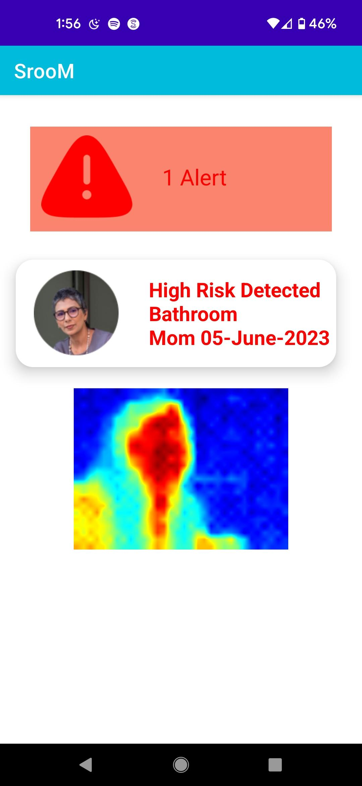

# Fall Detection System

## Introduction

This project presents an innovative fall detection system designed for elderly individuals living alone. The system uses a combination of a Geophone and a Thermal Imaging Camera to detect falls and alert caregivers instantly, ensuring timely assistance while maintaining the privacy of the elderly.

## Problem Statement

The world's elderly population is growing rapidly, with 1 billion elderly people today expected to double by 2050. In the U.S., 27% of adults aged 60 and older live alone. One in four elderly individuals (65+) experience falls each year, resulting in approximately 36,000 deaths annually. Traditional fall detection methods often require wearable devices, which can be uncomfortable and easy to forget. Moreover, many elderly individuals prefer to maintain their privacy and avoid being monitored by cameras.

## Intended Users

1. **Elderly People**: Particularly those who live alone and prefer non-wearable fall detection devices that preserve their privacy.
2. **Caregivers**: Individuals, such as children of the elderly, who are concerned about the safety of their loved ones and want to be alerted in case of falls.

## Design Question

How might we design a non-wearable fall detection device that provides timely alerts for caregivers while preserving the privacy of the elderly in case of falls?

## Solution and Features

The solution combines a Geophone and a Thermal Imaging Camera:
- **Geophone**: Detects falls by identifying vibrations caused by a fall.
- **Thermal Imaging Camera**: Activates to verify the fall and captures thermal images.

### Key Features:
- **Non-Wearable Device**: The system can be set up on a wall or floor.
- **Privacy-Preserving**: No common cameras are used; instead, a thermal imaging camera ensures privacy.
- **Instant Alerts**: Caregivers receive real-time alerts through a mobile application.

## Hardware Architecture

- **Geophone (SM-24 10Hz)**: Identifies vibrations and converts signals via an ADC.
- **Thermal Sensor (MLX90640)**: Captures thermal images upon detecting a fall.
- **ESP32**: Detects and sends data to a Raspberry Pi.
- **Raspberry Pi**: Stores data and uploads it to Firebase.
- **LED Strip + Photoresistor**: Provides nightlight functionality, controlled by surrounding light conditions.

## Software Architecture

- **Firebase Integration**: Stores thermal images and data.
- **Android Mobile App**: Receives and displays alerts, thermal images, and fall records.

## User Experience

1. **Fall Detection**: The Geophone detects a fall and triggers the thermal imaging camera.
2. **Alert Notification**: An alert is sent to the caregiver’s mobile app with thermal snapshots.
3. **Action**: Caregivers can check the situation and respond accordingly, including canceling false alarms.

## Prototypes and Demonstrations

- **Home Page**: Displays fall records and alerts.
- **Alert Push Notification**: Shows thermal snapshots for verification.
- **Cancel Alert**: Allows caregivers to cancel alerts after verification.
- **Add Profiles**: Enables adding multiple elderly individuals to the caregiver’s profile.

## APP UI
  
